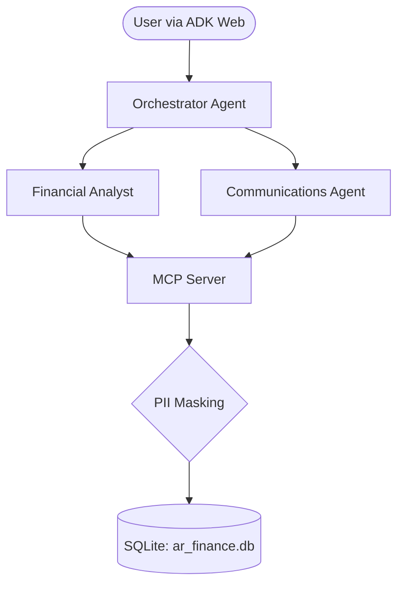

# Collections intelligence agent

An AI-powered financial operations assistant that lets finance teams query
real-time customer balances, analyze accounts receivable aging (30/60/90+
days), and draft contextual, professional collection notices for overdue
accounts — built for Kaggle's *AI Agents: Intensive Vibe Coding* capstone.

> All data in this project is synthetic. No real customer, vendor, or
> financial information is used anywhere in this repository.

## Problem

Finance teams spend significant manual effort each week reviewing AR aging
reports and drafting collection follow-ups, often inconsistently across
customers and account tiers. This project automates the analysis and
first-draft communication step while keeping a human firmly in control of
anything that actually gets sent to a customer.

## How it works

Three specialized agents, coordinated by an orchestrator, built on
[Google's Agent Development Kit (ADK)](https://google.github.io/adk-docs/):

- **Financial analyst agent** — answers natural-language balance and aging
  questions, computes exposure risk, and identifies overdue accounts.
- **Communications agent** — drafts a polite-but-firm, tier-appropriate
  collection notice for accounts the analyst flags.
- **Orchestrator agent** — routes requests between the two and enforces the
  human-in-the-loop approval gate before anything is treated as "ready to
  send."

Neither agent touches the database directly — both reach data through a
custom **MCP server**, which also enforces PII masking before any result
reaches an agent's context. See [Architecture](#architecture).

## Architecture



The system uses LLM delegation. The Orchestrator evaluates the user's intent:
1. **Financial questions** (balances, aging, overdue accounts) go to the Financial Analyst.
2. **Drafting requests** go to the Communications agent.
3. **Approval requests** are handled directly by the Orchestrator.

The agents never talk to the database directly. All queries pass through the FastMCP server, which enforces PII masking (`tax_id`, `bank_account_number`) in Python before the data ever reaches an agent's context window.

## Tech stack

| Layer | Choice |
|---|---|
| Agent framework | Google ADK (Python) |
| Data access | Custom MCP server (Python `mcp` SDK) |
| Database | SQLite (synthetic data, `Faker`-generated) |
| LLM | Gemini, via ADK's default model integration |
| Security | Server-side PII masking + human-in-the-loop approval gate |
| Packaging | Docker |
| Interface | ADK CLI (`adk run`) |

## Project status

- [x] Synthetic data model + seed script (`CUSTOMERS`, `INVOICES`,
      `INVOICE_LINE_ITEMS`, `PAYMENT_HISTORY`)
- [x] MCP server with PII-masking tool layer
- [x] Financial analyst agent
- [x] Communications agent
- [x] Orchestrator + human-in-the-loop approval gate
- [ ] Dockerfile / deployability
- [ ] Demo video + Kaggle writeup

## Setup

```bash
# 1. Clone and enter the repo
git clone <repo-url>
cd collections-intelligence-agent

# 2. Create a virtual environment
python -m venv .venv
source .venv/bin/activate   # Windows: .venv\Scripts\activate

# 3. Install dependencies
pip install -r requirements.txt

# 4. Configure your API key
cp .env.example .env
# then edit .env and add your Gemini API key

# 5. Generate the synthetic database
python scripts/seed_data.py

# 6. Start the agent interface
adk web agents/
```

## Data model

| Table | Purpose |
|---|---|
| `CUSTOMERS` | Account-level info: tier, contact, credit limit, and PII fields (`tax_id`, `bank_account_number`) used to demonstrate server-side masking |
| `INVOICES` | One row per invoice: amount, due date, payment status |
| `INVOICE_LINE_ITEMS` | Line-item detail per invoice |
| `PAYMENT_HISTORY` | Payments received against invoices |

All data is generated by `scripts/seed_data.py` using a fixed random seed and
a fixed reference date, so aging buckets look the same every time the script
runs — regardless of when you clone this repo.
