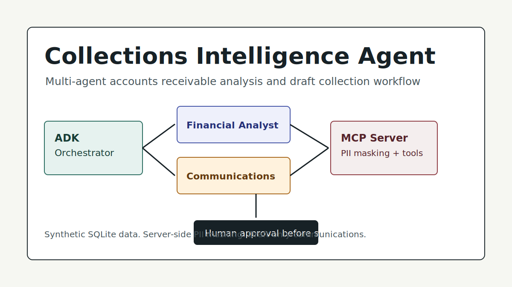
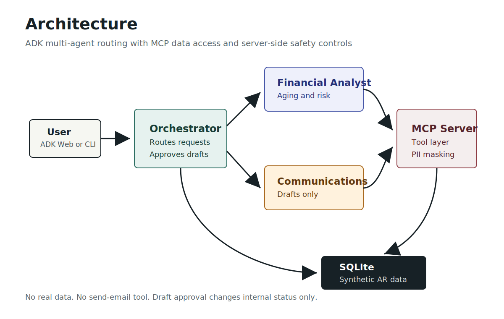
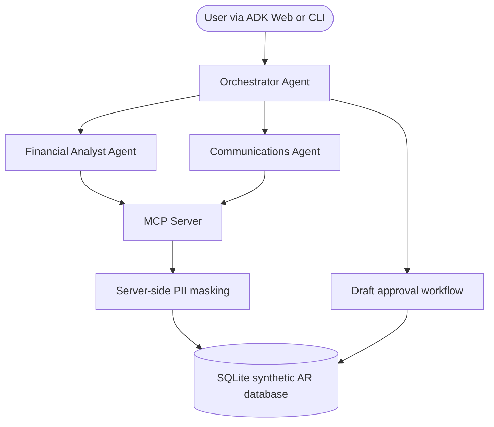

# Collections Intelligence Agent



An AI-powered financial operations assistant that lets finance teams query
customer balances, analyze accounts receivable aging, identify overdue
exposure, and draft contextual collection notices for human review. This
project was built for Kaggle's **AI Agents: Intensive Vibe Coding Capstone
Project** in the **Agents for Business** track.

> All data in this project is synthetic. No real customer, vendor, invoice,
> bank, tax, or payment data is used anywhere in this repository.

## Problem

Finance teams spend significant manual effort reviewing AR aging reports,
prioritizing overdue accounts, and drafting collection follow-ups. The work is
repetitive, but the stakes are high: inaccurate balances, inconsistent tone, or
accidental disclosure of account details can damage customer trust.

Collections Intelligence Agent automates the analysis and first-draft
communication workflow while keeping humans in control of every external
customer touchpoint.

## Solution

The system uses three ADK agents:

- **Orchestrator agent:** routes user requests, coordinates specialist agents,
  and owns the approval workflow.
- **Financial analyst agent:** answers natural-language questions about
  balances, AR aging, invoices, overdue accounts, and exposure risk.
- **Communications agent:** drafts professional, tier-aware collection notices
  and saves them as internal drafts for review.

Neither specialist agent connects directly to the database. All data access
goes through a custom **MCP server**, where masking and status changes are
enforced in Python code.

## Architecture





The orchestrator evaluates intent:

1. Financial analysis questions go to the Financial Analyst.
2. Drafting requests go to the Communications agent.
3. Draft review and approval requests stay with the Orchestrator.

Approval only changes an internal draft status from `pending_review` to
`approved`. This project intentionally has no email-sending tool.

## Capstone Concepts

| Kaggle key concept | Where demonstrated |
|---|---|
| Agent / multi-agent system (ADK) | `agents/agent.py`, `agents/financial_analyst/agent.py`, `agents/communications/agent.py` |
| MCP server | `mcp_server/server.py` |
| Security features | Server-side PII masking, tool filters, no send-email tool, draft approval gate |
| Deployability | `Dockerfile`, `.dockerignore`, local ADK setup commands |
| Agent skills / workflow | ADK-style separation of specialist agents, MCP tool filters, reproducible demo scripts |
| Antigravity | To be shown in the 5-minute demo video as part of the build workflow |

## Tech Stack

| Layer | Choice |
|---|---|
| Agent framework | Google ADK (Python) |
| Data access | Custom MCP server with Python `mcp` SDK |
| Database | SQLite with synthetic `Faker` data |
| LLM | Gemini via ADK configuration |
| Security | Server-side PII masking and human-in-the-loop approval |
| Packaging | Docker plus local virtualenv setup |
| Interface | ADK Web / ADK CLI |

## Project Status

- [x] Synthetic data model and seed script
- [x] MCP server with PII-masking tool layer
- [x] Financial analyst agent
- [x] Communications agent
- [x] Orchestrator and human approval workflow
- [x] Dockerfile for reproducible local demo
- [x] Kaggle writeup draft and media assets
- [ ] YouTube demo video
- [ ] Final Kaggle Writeup submission

## Setup

```bash
# 1. Clone and enter the repo
git clone <repo-url>
cd collections-intelligence-agent

# 2. Create a virtual environment
python -m venv .venv
source .venv/bin/activate

# 3. Install dependencies
pip install -r requirements.txt

# 4. Configure your Gemini API key
cp .env.example .env
# then edit .env and set GOOGLE_API_KEY

# 5. Generate the synthetic database
python scripts/seed_data.py

# 6. Start the agent interface
adk web agents/
```

Then open the ADK Web URL shown in your terminal.

`scripts/seed_data.py` is the source of the demo database. It rebuilds
`data/ar_finance.db` from deterministic Faker data, so local developers only
need to run it when first setting up the repo or when they want to reset the
demo data. The Docker demo runs it at container startup to guarantee every
demo starts from the same clean synthetic dataset.

## Docker Demo

```bash
docker build -t collections-intelligence-agent .
docker run --rm -p 8000:8000 --env-file .env collections-intelligence-agent
```

Then open `http://localhost:8000`. The container regenerates the synthetic
SQLite database at startup.

## Demo Prompts

```text
Who are our top 3 most overdue accounts?
```

```text
Draft a collection notice for the highest overdue account.
```

```text
List draft communications.
```

```text
Approve draft DRAFT-XXXXXXXX.
```

## MCP Tool Table

| Tool | Purpose | Agent access | Safety notes |
|---|---|---|---|
| `get_customer_summary` | Returns one customer's account summary | Financial Analyst, Communications | Masks `tax_id` and `bank_account_number` |
| `list_customers` | Lists synthetic customers | Financial Analyst | Masks customer PII fields |
| `get_customer_invoices` | Returns invoices for a customer | Financial Analyst, Communications | Parameterized by `customer_id` |
| `get_invoice_details` | Returns invoice lines and payments | Financial Analyst | Parameterized by `invoice_id` |
| `get_ar_aging_report` | Aggregates open balances by aging bucket | Financial Analyst | Read-only |
| `get_overdue_accounts` | Ranks overdue accounts by exposure | Financial Analyst | Returns business contact context only |
| `save_draft_communication` | Saves a draft with `pending_review` status | Communications | Validates customer ID; does not send |
| `list_draft_communications` | Lists draft statuses | Orchestrator | Does not expose draft body by default |
| `approve_communication` | Marks a pending draft as approved | Orchestrator | Approval is internal only; no send action |

## Data Model

| Table | Purpose |
|---|---|
| `CUSTOMERS` | Account tier, contact, credit limit, and synthetic PII fields for masking demonstration |
| `INVOICES` | Invoice date, due date, amount, amount paid, and status |
| `INVOICE_LINE_ITEMS` | Line-item detail for each invoice |
| `PAYMENT_HISTORY` | Synthetic payments received against invoices |
| `DRAFT_COMMUNICATIONS` | Internal draft notices and review status |

All data is generated by `scripts/seed_data.py` with a fixed random seed and a
fixed reference date of `2026-06-20`, so aging buckets are reproducible.

## Security And Safety

- No real data is used.
- Secrets live in `.env`, which is gitignored. `.env.example` is the template.
- Customer `tax_id` and `bank_account_number` are masked inside MCP tool
  functions before results reach agent context.
- The communications agent only has draft tools. It has no email, SMTP, API, or
  notification tool.
- Drafts begin as `pending_review` and can only be marked `approved` through an
  explicit orchestrator tool call.
- Approval does not send, enqueue, or transmit a message.
- ADK runtime session files are ignored via `agents/.adk/`.

## Submission Assets

- Kaggle writeup draft: `docs/kaggle-writeup-draft.md`
- Demo video outline: `docs/demo-video-outline.md`
- Cover image: `docs/media/cover.svg`
- Architecture image: `docs/media/architecture.svg`

For Kaggle, attach the cover image and YouTube video to the Writeup media
gallery. Use the public GitHub repository URL as the project link unless a live
demo endpoint is deployed.
