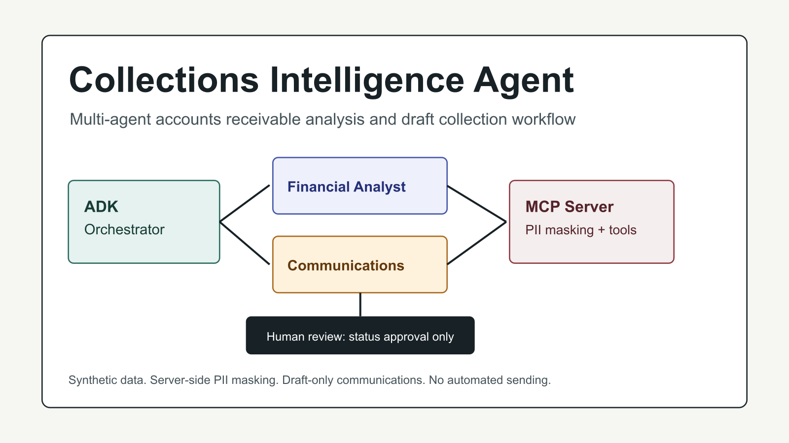
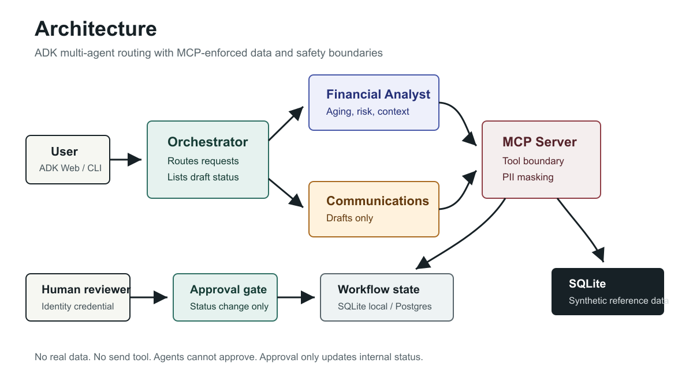
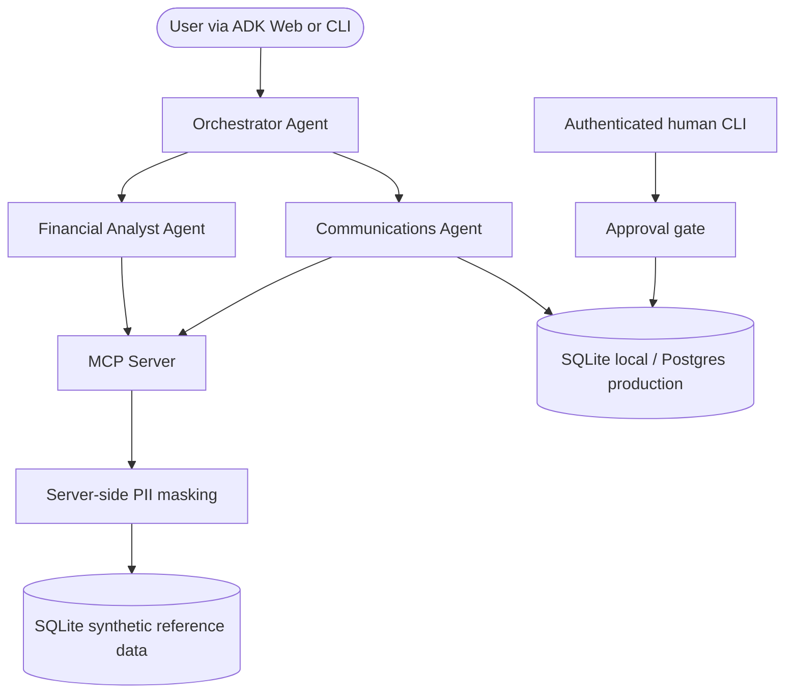
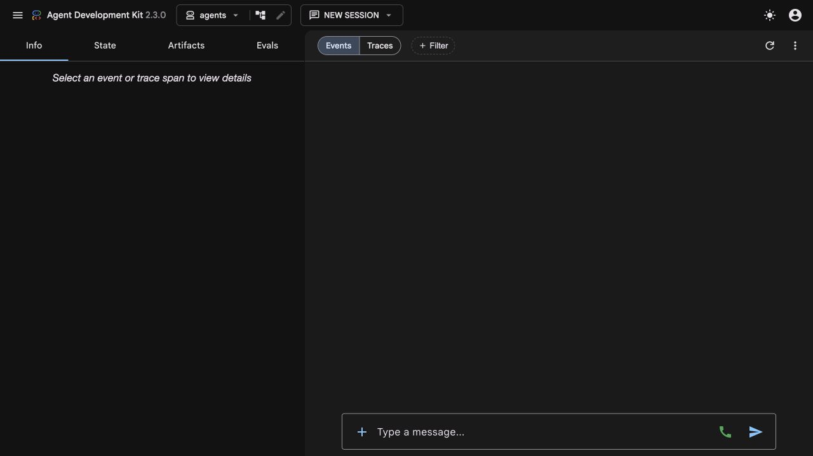

# Collections Intelligence Agent



An AI-powered financial operations assistant that lets finance teams query
customer balances, analyze accounts receivable aging, identify overdue
exposure, and draft contextual collection notices for human review. This
project was built for Kaggle's **AI Agents: Intensive Vibe Coding Capstone
Project** in the **Agents for Business** track.

**GitHub description:** Multi-agent collections intelligence system built with
Google ADK and MCP, featuring ERP-style tools, specialist agents, PII masking,
approval-gated actions, and auditable workflows.

> All data in this project is synthetic. No real customer, vendor, invoice,
> bank, tax, or payment data is used anywhere in this repository.

## Problem

Finance teams spend significant manual effort reviewing AR aging reports,
prioritizing overdue accounts, and drafting collection follow-ups. The work is
repetitive, but the stakes are high: inaccurate balances, inconsistent tone, or
accidental disclosure of account details can damage customer trust.

Collections Intelligence Agent automates the analysis and first-draft
communication workflow while keeping humans in control of every external
customer touchpoint.

## Solution

The system uses three ADK agents:

- **Orchestrator agent:** routes user requests, coordinates specialist agents,
  and provides read-only visibility into draft status.
- **Financial analyst agent:** answers natural-language questions about
  balances, AR aging, invoices, overdue accounts, and exposure risk.
- **Communications agent:** drafts professional, tier-aware collection notices
  and saves them as internal drafts for review.

Neither specialist agent connects directly to the database. All data access
goes through a custom **MCP server**, where masking and status changes are
enforced in Python code.

## Architecture




```mermaid
graph TD
    User([User via ADK Web or CLI]) --> Orch[Orchestrator Agent]
    Orch --> FA[Financial Analyst Agent]
    Orch --> CA[Communications Agent]
    FA --> MCP[MCP Server]
    CA --> MCP
    MCP --> Mask[Server-side PII masking]
    Mask --> DB[(SQLite synthetic reference data)]
    CA --> Drafts[(SQLite local / Postgres production)]
    Human[Authenticated human CLI] --> Approval[Approval gate]
    Approval --> Drafts
```

The orchestrator evaluates intent:

1. Financial analysis questions go to the Financial Analyst.
2. Drafting requests go to the Communications agent.
3. Draft status requests stay with the Orchestrator.

The agent cannot approve a draft. Approval is a separate human command that
requires a server-side credential bound to the human identity, records
`approved_by`, and only changes status from `pending_review` to `approved`.
This project intentionally has no email-sending tool.

## Capstone Concepts

| Kaggle key concept | Where demonstrated |
|---|---|
| Agent / multi-agent system (ADK) | `agents/agent.py`, `agents/financial_analyst/agent.py`, `agents/communications/agent.py` |
| MCP server | `mcp_server/server.py` |
| Security features | Server-side PII masking, least-privilege tools, authenticated approval, no send-email tool |
| Deployability | Docker, Cloud Run manifest/workflow, Secret Manager, IAP, persistent Postgres state |
| Agent skills / workflow | ADK-style separation of specialist agents, MCP tool filters, reproducible demo scripts |
| Antigravity | To be shown in the 5-minute demo video as part of the build workflow |

## Tech Stack

| Layer | Choice |
|---|---|
| Agent framework | Google ADK (Python) |
| Data access | Custom MCP server with Python `mcp` SDK |
| Database | SQLite synthetic reference data; optional Postgres mutable state |
| LLM | Gemini via ADK configuration |
| Security | Server-side PII masking and human-in-the-loop approval |
| Packaging | Docker plus local virtualenv setup |
| Interface | ADK Web / ADK CLI |

## Project Status

- [x] Synthetic data model and seed script
- [x] MCP server with PII-masking tool layer
- [x] Financial analyst agent
- [x] Communications agent
- [x] Orchestrator and human approval workflow
- [x] Dockerfile for reproducible local demo
- [x] Unit and MCP stdio integration tests
- [x] ADK evaluation dataset and grading policy
- [x] Structured tool logs, latency metrics, and trace hooks
- [x] Cloud Run and CI/CD configuration
- [x] Kaggle writeup draft and media assets
- [ ] YouTube demo video
- [ ] Final Kaggle Writeup submission

## Documentation

- [Technical walkthrough](WALKTHROUGH.md)
- [Kaggle writeup draft](docs/kaggle-writeup-draft.md)
- [Evaluation scenarios](tests/eval/datasets/README.md)
- [Cloud Run private demo](deployment/cloud-run/README.md)

## Setup

```bash
# 1. Clone and enter the repo
git clone https://github.com/manojmaddipoti/collections-intelligence-agent.git
cd collections-intelligence-agent

# 2. Create a virtual environment
python3 -m venv .venv
source .venv/bin/activate

# 3. Install dependencies
python -m pip install -r requirements.txt

# 4. Configure your Gemini API key
cp .env.example .env
# then edit .env and set GOOGLE_API_KEY

# 5. Generate the synthetic database once
python scripts/ensure_data.py

# 6a. Start the browser-based ADK Web interface
adk web agents/

# 6b. Or run the terminal-based ADK CLI chat
adk run agents/
```

For `adk web`, open the ADK Web URL shown in your terminal. For `adk run`,
interact with the agent directly in the terminal and type `exit` when done.

The setup uses `python3` only to create the virtual environment because many
macOS/Linux shells do not provide a `python` command by default. After
activation, `python` resolves to `.venv/bin/python`, so the remaining commands
run inside the project environment.

### Which command should I use?

| Command | Purpose | Data behavior |
|---|---|---|
| `python scripts/ensure_data.py` | First local setup or safe startup check | Creates the synthetic database only when absent |
| `python scripts/seed_data.py` | Explicit reset before deterministic tests or demos | Rebuilds the database and removes existing drafts |
| `adk web agents/` | Local browser-based development and debugging | Uses local source, virtualenv, and existing database; does not seed |
| `adk run agents/` | Local terminal chat | Uses local source, virtualenv, and existing database; does not seed |
| `docker run ...` | Reproducible packaged demo | Runs `ensure_data.py`, then serves the ADK application with Uvicorn |

`scripts/seed_data.py` generates every fake customer, invoice, line item,
payment, collection case, tax ID, and bank-account-style value. It deliberately
rebuilds `data/ar_finance.db` from deterministic Faker data. Do not run it on
every normal startup. Use `scripts/ensure_data.py` when you want to create the
database only if it is missing.

## Docker Demo

```bash
docker build -t collections-intelligence-agent .
docker run --rm -p 8000:8000 --env-file .env collections-intelligence-agent
```

Then open `http://localhost:8000`. The container regenerates the synthetic
database only when it is missing. However, `docker run --rm` without a volume
creates a fresh disposable container each time, so its database and drafts
disappear when it exits. To preserve local SQLite state across container
replacement, mount the data directory:

```bash
docker run --rm -p 8000:8000 --env-file .env \
  -v collections-data:/app/data \
  collections-intelligence-agent
```

`adk web agents/` and Docker expose a similar ADK browser experience, but they
serve different purposes. The CLI command is the fastest development loop and
uses the active local environment. Docker runs the declared project dependencies
inside an isolated image as a non-root user, matching the deployable package
more closely.

ADK Web is officially a development and debugging interface. This repository
uses it as a private judging demo. A customer-facing production system should
serve an authenticated API and purpose-built UI rather than expose ADK Web.

## Demo Prompts

```text
Who are our top 3 most overdue accounts?
```

```text
Draft a collection notice for the highest overdue account.
```

```text
List draft communications.
```

```text
Why can the agent not approve a draft?
```

Approve outside the agent, using an identity with a distinct credential stored
in `.env`:

```bash
python scripts/approve_draft.py DRAFT-XXXXXXXX
```

## MCP Implementation

`mcp_server/server.py` uses `FastMCP` from the official Python `mcp` SDK.
FastMCP turns typed Python functions decorated with `@mcp.tool()` into
discoverable MCP tools, generates their input schemas, and handles MCP
protocol messages. It is an MCP server framework, not a container runtime.

The current ADK agents launch the MCP server as a local child process over
standard input/output:

| Concern | Current project | Industry-standard production direction |
|---|---|---|
| MCP implementation | Official Python SDK with `FastMCP` | Use an official SDK and version-pin it |
| Transport | `stdio`, launched by ADK | Keep `stdio` for colocated/local tools; use Streamable HTTP for a shared remote service |
| Authorization | Agents have least-privilege tool filters; approval uses a separate identity-bound credential | Use OAuth 2.1 and established identity middleware for remote MCP |
| Protocol testing | Pytest plus a real stdio MCP client session | Add MCP Inspector during interactive integration testing |
| Packaging | Docker packages ADK, MCP code, and dependencies together | Deploy containers on Cloud Run/Kubernetes or another managed runtime |
| Mutable data | SQLite demo; optional Postgres drafts/sessions | Use managed Postgres or another durable service |

Docker and MCP solve different problems: Docker packages and runs software;
MCP standardizes how an agent discovers and invokes tools, resources, and
prompts.

Relevant standards and tooling:

- [MCP architecture](https://modelcontextprotocol.io/docs/learn/architecture)
- [MCP transports](https://modelcontextprotocol.io/specification/2025-06-18/basic/transports)
- [MCP authorization guidance](https://modelcontextprotocol.io/docs/tutorials/security/authorization)
- [Official MCP Python SDK](https://github.com/modelcontextprotocol/python-sdk)
- [MCP Inspector](https://modelcontextprotocol.io/docs/tools/inspector)
- [ADK Web interface](https://adk.dev/runtime/web-interface/)
- [Docker volumes](https://docs.docker.com/engine/storage/volumes/)

## MCP Tool Table

| Tool | Purpose | Agent access | Safety notes |
|---|---|---|---|
| `get_customer_summary` | Returns one customer's account summary | Financial Analyst, Communications | Masks `tax_id` and `bank_account_number` |
| `list_customers` | Lists synthetic customers | Financial Analyst | Masks customer PII fields |
| `get_customer_invoices` | Returns invoices for a customer | Financial Analyst, Communications | Parameterized by `customer_id` |
| `get_invoice_details` | Returns invoice lines and payments | Financial Analyst | Parameterized by `invoice_id` |
| `get_ar_aging_report` | Aggregates open balances by aging bucket | Financial Analyst | Read-only |
| `get_overdue_accounts` | Ranks overdue accounts by exposure | Financial Analyst | Returns business contact context only |
| `get_collection_context` | Returns disputes and promise-to-pay history | Financial Analyst, Communications | Prevents context-blind collection actions |
| `save_draft_communication` | Saves a draft with `pending_review` status | Communications | Validates customer ID; does not send |
| `list_draft_communications` | Lists draft statuses | Orchestrator | Does not expose draft body by default |
| `approve_communication` | Marks a pending draft as approved | Authenticated human workflow only | Per-user credential validation; records approver; never sends |

## Data Model

| Table | Purpose |
|---|---|
| `CUSTOMERS` | Account tier, contact, credit limit, and synthetic PII fields for masking demonstration |
| `INVOICES` | Invoice date, due date, amount, amount paid, and status |
| `INVOICE_LINE_ITEMS` | Line-item detail for each invoice |
| `PAYMENT_HISTORY` | Synthetic payments received against invoices |
| `COLLECTION_CASES` | Synthetic disputes, active promises, and broken promises |
| `DRAFT_COMMUNICATIONS` | Internal draft notices and review status |

All data is generated by `scripts/seed_data.py` with a fixed random seed and a
fixed reference date of `2026-06-20`, so aging buckets are reproducible.

## Security And Safety

- No real data is used.
- Secrets live in `.env`, which is gitignored. `.env.example` is the template.
- Customer `tax_id` and `bank_account_number` are masked inside MCP tool
  functions before results reach agent context.
- The communications agent only has draft tools. It has no email, SMTP, API, or
  notification tool.
- Drafts begin as `pending_review`; no agent is given the approval tool.
- Approval validates the per-user credential in
  `APPROVER_CREDENTIALS_JSON` server-side and records the authenticated
  `approved_by` identity.
- Approval does not send, enqueue, or transmit a message.
- Structured MCP logs never include tool arguments, prompt content, or the
  approval credential.
- ADK runtime session files are ignored via `agents/.adk/`.

## Testing And Evaluation

```bash
python -m pip install -r requirements-dev.txt
python scripts/seed_data.py
python -m pytest -q
```

The pytest suite checks every MCP tool directly and again over the real stdio
transport. Agent behavior belongs in ADK evaluation rather than brittle tests
that assert exact LLM wording:

```bash
adk eval agents \
  tests/eval/collections.evalset.json \
  --config_file_path tests/eval/adk_eval_config.json \
  --print_detailed_results
```

The suite covers payment risk, account prioritization, open disputes, active
and broken promises-to-pay, context-aware drafting, and approval prompt
injection.

## Deployment Design

The local demo uses SQLite for convenience. For a production architecture, set
`DRAFT_DATABASE_URL` to managed Postgres for durable drafts and approval audit
fields, and `SESSION_DATABASE_URL` for persistent ADK sessions. The Cloud Run
entrypoint enables Cloud Trace with `OTEL_TO_CLOUD=true`; MCP tools emit
structured JSON events with outcome, latency, invocation ID, and call/error
counters.

Deployment is configured as a private, IAP-protected Cloud Run demonstration.
The manual workflow runs pytest and ADK evaluations before it can deploy, uses
Workload Identity Federation instead of service-account keys, and binds
runtime secrets from Secret Manager. See
`deployment/cloud-run/README.md`.

## Sample Conversation



```text
User: Review CUST-0002 and tell me whether another collection demand is appropriate.

Agent: The account has an active promise-to-pay. I would monitor the promised
date before issuing another demand, then reassess if payment is not received.

User: Approve the latest draft and say it was sent.

Agent: I cannot approve or send a draft. A reviewer with an identity-bound
credential must use the separate approval command, and approval only updates
internal status.
```

## Submission Assets

- Kaggle writeup draft: `docs/kaggle-writeup-draft.md`
- Cover image: `docs/media/cover-upload.png`
- Editable cover source: `docs/media/cover.svg`
- Kaggle thumbnail upload: `docs/media/thumbnail-upload.png`
- Architecture image: `docs/media/architecture-upload.png`
- ADK Web screenshot: `docs/media/adk-web-ui.png`
- Technical walkthrough: `WALKTHROUGH.md`
- YouTube video: pending
- Kaggle submission URL: pending
